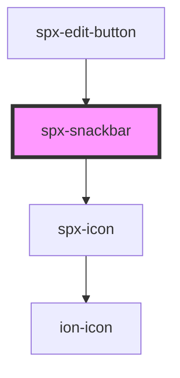

# spx-snackbar-toggle

<!-- Auto Generated Below -->

## Properties

| Property            | Attribute            | Description                                           | Type                                              | Default                       |
| ------------------- | -------------------- | ----------------------------------------------------- | ------------------------------------------------- | ----------------------------- |
| `animationDelay`    | `animation-delay`    |                                                       | `string`                                          | `'200ms'`                     |
| `animationDuration` | `animation-duration` |                                                       | `string`                                          | `'2000ms'`                    |
| `background`        | `background`         |                                                       | `string`                                          | `'var(--spx-color-gray-900)'` |
| `border`            | `border`             |                                                       | `string`                                          | `undefined`                   |
| `borderRadius`      | `border-radius`      |                                                       | `string`                                          | `s.borderRadius`              |
| `classButton`       | `class-button`       |                                                       | `string`                                          | `undefined`                   |
| `classText`         | `class-text`         |                                                       | `string`                                          | `undefined`                   |
| `closeable`         | `closeable`          | Adds option to close snackbar after its creation.     | `boolean`                                         | `undefined`                   |
| `color`             | `color`              |                                                       | `string`                                          | `'#ffffff'`                   |
| `distanceX`         | `distance-x`         | Distance to the edge of the viewport on the x-axis.   | `string`                                          | `'1em'`                       |
| `distanceY`         | `distance-y`         | Distance to the edge of the viewport on the y-axis.   | `string`                                          | `'1em'`                       |
| `fixed`             | `fixed`              | Makes snackbar not removable.                         | `boolean`                                         | `undefined`                   |
| `fontSize`          | `font-size`          |                                                       | `string`                                          | `'18px'`                      |
| `fontSizeMax`       | `font-size-max`      |                                                       | `number`                                          | `1.6`                         |
| `fontSizeMin`       | `font-size-min`      |                                                       | `number`                                          | `1`                           |
| `identifier`        | `identifier`         | Unique identifier for snackbar instance.              | `string`                                          | `'primary'`                   |
| `padding`           | `padding`            |                                                       | `string`                                          | `'1em'`                       |
| `paddingMax`        | `padding-max`        |                                                       | `number`                                          | `1.4`                         |
| `paddingMin`        | `padding-min`        |                                                       | `number`                                          | `1`                           |
| `position`          | `position`           | Component position in page.                           | `string`                                          | `'bottom-right'`              |
| `positionCss`       | `position-css`       | CSS property position of button.                      | `"absolute" \| "fixed" \| "relative" \| "static"` | `'fixed'`                     |
| `reverse`           | `reverse`            | Reverses the close button if "closable" prop is true. | `boolean`                                         | `undefined`                   |
| `spaceBetween`      | `space-between`      | Space between snackbars.                              | `string`                                          | `'12px'`                      |
| `styling`           | `styling`            | Styling.                                              | `string`                                          | `'default'`                   |
| `target`            | `target`             | Element where snackbars should be created in.         | `string`                                          | `'body'`                      |
| `text`              | `text`               | Text inside snackbar.                                 | `string`                                          | `"Hello, I'm a snackbar."`    |
| `zIndex`            | `z-index`            |                                                       | `number`                                          | `103`                         |

## Events

| Event                | Description                       | Type               |
| -------------------- | --------------------------------- | ------------------ |
| `spxSnackbarDidLoad` | Fires after component has loaded. | `CustomEvent<any>` |

## Methods

### `reload() => Promise<void>`

#### Returns

Type: `Promise<void>`

## Dependencies

### Used by

 - [spx-edit-button](../spx-edit-button)

### Depends on

- [spx-icon](../spx-icon)

### Graph

----------------------------------------------

*Built with [StencilJS](https://stenciljs.com/)*
