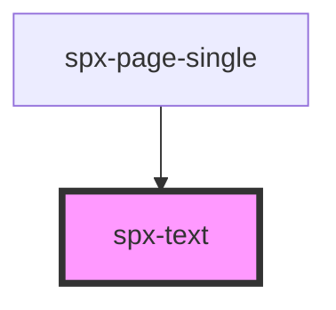

# spx-text

<!-- Auto Generated Below -->

## Properties

| Property                    | Attribute                      | Description                                             | Type      | Default                           |
| --------------------------- | ------------------------------ | ------------------------------------------------------- | --------- | --------------------------------- |
| `contentFontSizeMultiplier` | `content-font-size-multiplier` | Only works if text-type is set to 'multiply'.           | `number`  | `1`                               |
| `headingColor`              | `heading-color`                |                                                         | `string`  | `'var(--spx-color-black)'`        |
| `headingFontFamily`         | `heading-font-family`          |                                                         | `string`  | `state.fontFamilyPrimary`         |
| `headingFontWeight`         | `heading-font-weight`          |                                                         | `string`  | `'500'`                           |
| `headingLetterSpacing`      | `heading-letter-spacing`       |                                                         | `string`  | `'0'`                             |
| `headingLineHeight`         | `heading-line-height`          |                                                         | `string`  | `'1.5'`                           |
| `headingTextTransform`      | `heading-text-transform`       |                                                         | `string`  | `'default'`                       |
| `linkDecorationColor`       | `link-decoration-color`        |                                                         | `string`  | `'var(--spx-color-primary-A700)'` |
| `markdown`                  | `markdown`                     | Parse markdown.                                         | `boolean` | `false`                           |
| `maxWidth`                  | `max-width`                    |                                                         | `string`  | `'clamp(700px, 40vw, 1200px)'`    |
| `textColor`                 | `text-color`                   |                                                         | `string`  | `'var(--spx-color-gray-700)'`     |
| `textFontFamily`            | `text-font-family`             |                                                         | `string`  | `state.fontFamilySecondary`       |
| `textFontWeight`            | `text-font-weight`             |                                                         | `string`  | `'400'`                           |
| `textLetterSpacing`         | `text-letter-spacing`          |                                                         | `string`  | `'0'`                             |
| `textLineHeight`            | `text-line-height`             |                                                         | `string`  | `'1.5'`                           |
| `textMaxW`                  | `text-max-w`                   | Maximum viewport width when text-type is set to linear. | `number`  | `2560`                            |
| `textMinW`                  | `text-min-w`                   | Minimum viewport width when text-type is set to linear. | `number`  | `320`                             |
| `textTextTransform`         | `text-text-transform`          |                                                         | `string`  | `'default'`                       |
| `textType`                  | `text-type`                    |                                                         | `string`  | `'linear'`                        |

## Dependencies

### Used by

 - [spx-page-single](../spx-page)

### Graph

----------------------------------------------

*Built with [StencilJS](https://stenciljs.com/)*
