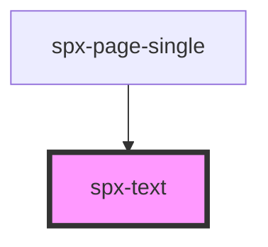

# spx-text

<!-- Auto Generated Below -->

## Properties

| Property               | Attribute                | Description     | Type      | Default                          |
| ---------------------- | ------------------------ | --------------- | --------- | -------------------------------- |
| `h1FontSizeMax`        | `h1-font-size-max`       |                 | `number`  | `3.2`                            |
| `h1FontSizeMin`        | `h1-font-size-min`       |                 | `number`  | `1.6`                            |
| `h2FontSizeMax`        | `h2-font-size-max`       |                 | `number`  | `2.2`                            |
| `h2FontSizeMin`        | `h2-font-size-min`       |                 | `number`  | `1.4`                            |
| `h3FontSizeMax`        | `h3-font-size-max`       |                 | `number`  | `1.8`                            |
| `h3FontSizeMin`        | `h3-font-size-min`       |                 | `number`  | `1.2`                            |
| `h4FontSizeMax`        | `h4-font-size-max`       |                 | `number`  | `1.6`                            |
| `h4FontSizeMin`        | `h4-font-size-min`       |                 | `number`  | `1`                              |
| `headingColor`         | `heading-color`          |                 | `string`  | `'var(--spx-color-black)'`       |
| `headingFontFamily`    | `heading-font-family`    |                 | `string`  | `state.fontFamilyPrimary`        |
| `headingFontWeight`    | `heading-font-weight`    |                 | `string`  | `'500'`                          |
| `headingLetterSpacing` | `heading-letter-spacing` |                 | `string`  | `'0'`                            |
| `headingLineHeight`    | `heading-line-height`    |                 | `string`  | `'1.5'`                          |
| `headingTextTransform` | `heading-text-transform` |                 | `string`  | `'default'`                      |
| `linkDecorationColor`  | `link-decoration-color`  |                 | `string`  | `'var(--spx-color-primary-600)'` |
| `markdown`             | `markdown`               | Parse markdown. | `boolean` | `false`                          |
| `maxWidth`             | `max-width`              |                 | `string`  | `'768px'`                        |
| `paddingFigureMax`     | `padding-figure-max`     |                 | `number`  | `3`                              |
| `paddingFigureMin`     | `padding-figure-min`     |                 | `number`  | `0.9`                            |
| `spaceBeforeH1Max`     | `space-before-h-1-max`   |                 | `number`  | `8`                              |
| `spaceBeforeH1Min`     | `space-before-h-1-min`   |                 | `number`  | `4`                              |
| `spaceBetweenMax`      | `space-between-max`      |                 | `number`  | `2`                              |
| `spaceBetweenMin`      | `space-between-min`      |                 | `number`  | `0.9`                            |
| `spaceBetweenPMax`     | `space-between-p-max`    |                 | `number`  | `1.5`                            |
| `spaceBetweenPMin`     | `space-between-p-min`    |                 | `number`  | `0.9`                            |
| `textColor`            | `text-color`             |                 | `string`  | `'var(--spx-color-gray-700)'`    |
| `textFontFamily`       | `text-font-family`       |                 | `string`  | `state.fontFamilySecondary`      |
| `textFontSizeMax`      | `text-font-size-max`     |                 | `number`  | `1.4`                            |
| `textFontSizeMin`      | `text-font-size-min`     |                 | `number`  | `1`                              |
| `textFontWeight`       | `text-font-weight`       |                 | `string`  | `'400'`                          |
| `textLetterSpacing`    | `text-letter-spacing`    |                 | `string`  | `'0'`                            |
| `textLineHeight`       | `text-line-height`       |                 | `string`  | `'1.5'`                          |
| `textTextTransform`    | `text-text-transform`    |                 | `string`  | `'default'`                      |

## Events

| Event            | Description                       | Type               |
| ---------------- | --------------------------------- | ------------------ |
| `spxTextDidLoad` | Fires after component has loaded. | `CustomEvent<any>` |

## Dependencies

### Used by

 - [spx-page-single](../spx-page)

### Graph

----------------------------------------------

*Built with [StencilJS](https://stenciljs.com/)*
