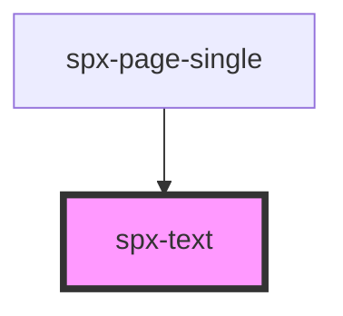

# spx-text

<!-- Auto Generated Below -->

## Properties

| Property                    | Attribute                      | Description | Type     | Default                        |
| --------------------------- | ------------------------------ | ----------- | -------- | ------------------------------ |
| `contentFontSizeMultiplier` | `content-font-size-multiplier` |             | `number` | `1`                            |
| `headingColor`              | `heading-color`                |             | `string` | `'var(--spx-color-black)'`     |
| `headingFontFamily`         | `heading-font-family`          |             | `string` | `state.fontFamilyPrimary`      |
| `headingFontWeight`         | `heading-font-weight`          |             | `string` | `'500'`                        |
| `headingLetterSpacing`      | `heading-letter-spacing`       |             | `string` | `'0'`                          |
| `headingLineHeight`         | `heading-line-height`          |             | `string` | `'1.5'`                        |
| `headingTextTransform`      | `heading-text-transform`       |             | `string` | `'default'`                    |
| `maxWidth`                  | `max-width`                    |             | `string` | `'clamp(700px, 40vw, 1200px)'` |
| `textColor`                 | `text-color`                   |             | `string` | `'var(--spx-color-gray-700)'`  |
| `textFontFamily`            | `text-font-family`             |             | `string` | `state.fontFamilySecondary`    |
| `textFontWeight`            | `text-font-weight`             |             | `string` | `'400'`                        |
| `textLetterSpacing`         | `text-letter-spacing`          |             | `string` | `'0'`                          |
| `textLineHeight`            | `text-line-height`             |             | `string` | `'1.5'`                        |
| `textTextTransform`         | `text-text-transform`          |             | `string` | `'default'`                    |

## Dependencies

### Used by

 - [spx-page-single](../spx-page)

### Graph

----------------------------------------------

*Built with [StencilJS](https://stenciljs.com/)*
